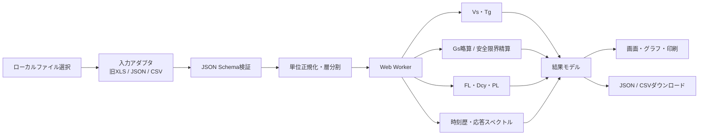

# 地盤解析Webアプリ構築準備調査

- 調査日: 2026-07-19
- 調査対象: `地盤シート.xls`
- 想定成果物: JavaScript/TypeScriptによる静的Webアプリ
- データ交換: ローカルファイルのアップロード／ダウンロード
- 追加方針: Web版でExcelシートを再現・作成・出力しない
- 本書の位置付け: 要件整理、既存資産解析、技術調査、実装・検証計画

> 注意: 本書は実装準備資料であり、確認申請用の計算書、法適合判定、地盤調査報告書そのものではない。法適合を表示する版は、構造設計者・地盤技術者による計算式、適用条件、試験データおよび出力の承認を経てリリースすること。

## 1. 結論

ブラウザ内だけで動作する地盤解析アプリへの移植は可能である。ただし、既存Excelを画面や数式エンジンごと再現するのではなく、次の構成に置き換えるべきである。

1. 旧 `.xls` は既存案件の入力を取り込むための一方向アダプタとして扱う。
2. 計算用の正本は、単位・計算法・版・警告を明記したJSONとする。
3. 地盤増幅、Vs推定、液状化、応答スペクトルをTypeScriptの純粋関数として実装する。
4. 時間のかかる反復計算と時刻歴計算はWeb Worker内で実行する。
5. 結果はJSON、CSV、印刷用HTML/PDFで出力し、Excelは生成しない。
6. 実行時のサーバー、外部API、外部実行ファイル、Excel、VBA、`analysis.bat`、`DYNES3D`への依存をなくす。

最重要の技術判断は、現行基準の計算と旧シート互換計算を分離することである。旧VBAには現在の取扱いと異なる処理があるため、旧シートの数値一致だけをもって法適合とはできない。

| 論点 | 推奨 |
|---|---|
| 損傷限界時の `Gs` | 現行基準モードでは地盤種別による略算法だけを許可する |
| 安全限界時の `Gs` | 略算法、または適用条件を満たす精算法 |
| 旧シートの損傷限界精算 | 回帰・調査用の「旧シート照合モード」にだけ残し、法適合値として表示しない |
| 等価減衰 | 現行基準モードでは旧シートの最終 `0.8` 倍を使用しない |
| 非線形特性 | 現行精算法では調査・動的試験由来の `G/G0–γ`、`h–γ` を入力できる構造にする |
| 正本ファイル | バージョン付きJSON |
| Excel | 旧ファイルの入力取り込みだけ。画面再現、数式実行、Excel出力は行わない |

## 2. 調査範囲と方法

元ファイルを変更せず、ワークブック構造、セル値・式、名前定義、VBAソース、外部参照、保存済み計算値を読み取り専用で調査した。旧形式を一時コピーへ変換した環境ではVBAユーザー定義関数が実行されないため、表示された `#NAME?`、`#VALUE!`、`#REF!` を元Excelの計算結果とはみなしていない。式の意図は元VBAと保存値から確認した。

Web調査は、国土交通省、e-Gov、国立国会図書館、建築研究所、農林水産省、J-STAGE等の公的・一次資料を優先した。ソフトウェアは公式ドキュメントと公式GitHubリポジトリを確認した。

## 3. `地盤シート.xls` の解析結果

### 3.1 シート構成

| シート | 主な使用範囲 | Web移植時の役割 |
|---|---:|---|
| `資料②` | A1:L38 | 近隣ボーリング資料。精算法の適用条件・出典管理へ置換 |
| `資料④` | A1:J58 | 工学的基盤の標高差と傾斜角の確認 |
| `表紙` | A1:I45 | 入力・計算結果のチェックリスト。Webの案件サマリーへ置換 |
| `メイン` | 実セル A1:AM123 | 物件、N値、地層、地下水位、地盤補強、Vs、Tgの主入力 |
| `液説明` | 実セルは少数 | 液状化式の説明。Webヘルプと計算根拠へ置換 |
| `液Dcy` | A1:L86 | 150 gal／350 gal時のFL・Dcyと非液状化層厚判定 |
| `Gs説明` | 実セルは少数 | Gs式の説明。Webヘルプと計算根拠へ置換 |
| `ＧＳ` | A1:BN203 | 限界耐力計算法の地盤増幅、固有値、反復、Gs・Sa・Sv・Sd |
| `液PL` | A1:J63 | PL法。現ブックでは必要列が欠落し、保存結果を検証値にできない |
| `acc` | A1:H6004 | 3波の加速度時刻歴、Amax・Vmax・Dmax |
| `Spc` | A1:AG206 | STG、告示Gs法、外部時刻歴解析結果の比較 |
| `STG` | A1:I212 | Tg別STGスペクトルの折線補間 |

### 3.2 主入力

主な入力は、物件名、住所、コード、緯度・経度、地盤情報、地耐力、地盤補強深さ、地下水位、備考、深度別N値、最大15層の層序・土質・密度・細粒分・地質年代・土質係数、および工学的基盤である。

現在保存されている代表入力は次のとおりである。

- 地下水位: GL-0.7 m
- N値: 深度1～16 mに対し `1, 3, 16, 19, 10, 4, 3, 3, 3, 3, 5, 6, 7, 26, 30, 50`
- 表層地盤: 1.4 m 表土、4.0 m シルト質粘土、5.6 m 粘土、14.5 m 粘土、16.0 m 粘土質シルト
- 工学的基盤: GL-16.0 m、砂礫、密度2.0 t/m³、N=50、Vs=400 m/s

N値の層平均を求めるVBA `aveN` は、層上端を `z0`、層下端を `z1` としたとき `z0 < z <= z1` のN値を算術平均する。該当データがない場合の明示的なエラー処理がないため、Web版では「データなし」を警告として返す。

### 3.3 Vs推定と弾性地盤周期

シートの代表式は次式である。

\[
V_s=68.79N^{0.171}D^{0.199}Y_gS_t
\]

- `N`: 層内の平均N値
- `D`: 層中央深さ (m)
- `Yg`: 地質年代係数。沖積1.000、洪積1.303
- `St`: 土質係数

この式は2007年の国土交通省技術的助言にも示されている。ただし、旧シートの既定値テーブルは丸めや独自分類を含み、技術的助言の分類と完全には一致しない。

| 土質 | 旧シート既定値の例 | 技術的助言の係数 |
|---|---:|---:|
| 粘土 | 1.000 | 1.000 |
| 粘土質砂・シルト質砂 | 1.086 | 明示された基本6分類へ対応付けが必要 |
| 細砂 | 1.100 | 1.086 |
| 中砂 | 1.120 | 1.066 |
| 粗砂 | 1.135 | 1.135 |
| 砂礫 | 1.153 | 1.153 |
| 礫 | 1.448 | 1.448 |

したがって、Web版では次の二つを分ける。

- `regulatory` 係数表: 公的資料の分類・値を採用する。
- `legacy-sheet` 係数表: 旧案件の再現確認にだけ使用し、結果へ互換モードであることを表示する。

ユーザーがPS検層等によるVsを直接入力した場合は推定値より直接値を優先し、値の出典、調査日、試験法を保存する。

### 3.4 VBAと外部依存

主要なVBAは次のとおりである。

| モジュール | 主な処理 | Webでの置換先 |
|---|---|---|
| Module1 | `aveN`, `chisou`, `nf`, `ganmacy`, 対数補間 | TypeScript純粋関数・表データ |
| Module2 | 地層・N値再計算 | 入力変更時の状態更新 |
| Module3 | `.dat`作成、`analysis.bat`起動、完了ファイル監視 | Web Worker内の計算。外部プロセス廃止 |
| Module4 | `GS`, `gskouchi`、反復・固有値計算 | `core/gs` と `core/eigen` |
| Module5 | 地質名展開 | 入力アダプタ・表示ロジック |
| Module6 | 初期化 | 状態管理 |
| Module7 | 外部CSVの読込 | File APIによる明示的アップロード |
| Module8 | 波形変換 | `core/motion` |

旧時刻歴処理には次の依存・不整合があり、そのまま移植できない。

- `analysis.bat` をShell起動し、`calc_end.dat` をビジーウェイトする。
- `DYNES3D ver2.73`、`Gtimecal3D`、`SGS301DATA`、`Calcdynesresult*.csv`、`work*.dat` 等に依存する。
- `wspccsv1/2/3.csv`、`wave1/2/3.csv` をシートへ貼り付ける。
- `Range("Gss1")` と実際の名前 `_Gss1` など、名前不一致が残る。
- `BT0`, `ST0` ほか11件の名前定義が `#REF!` であり、一部の補間UDFは使用不能である。
- 過去作業フォルダの `SGS.xls` 等を指す孤立した外部ブックリンクが残る。
- VBA参照には環境依存のMSForms参照が含まれる。

Web版はVBAを実行せず、数式文字列も評価しない。旧 `.xls` からは入力セルだけを抽出する。

## 4. 地盤増幅 `Gs` の実装方針

### 4.1 現行制度とモード分離

建築基準法施行令第82条の5で用いる表層地盤の加速度増幅率 `Gs` は、平成12年建設省告示第1457号第10に基づく。2007年改正後の整理は次のとおりである。[e-Gov 建築基準法施行令](https://laws.e-gov.go.jp/law/325CO0000000338)、[国土交通省・告示第598号新旧対照表](https://www.mlit.go.jp/jutakukentiku/build/kensetu.files/18kaisei/kouzoukokuji.pdf)、[国土交通省・告示第1230号新旧対照表](https://www.mlit.go.jp/jutakukentiku/build/kensetu.files/18kaisei/kouzoukokuji2.pdf)

- 損傷限界時: 地盤種別による略算法のみ。
- 安全限界時: 略算法、または適用条件を満たした地盤調査結果による精算法。
- 告示第1457号には後年の改正もあるため、法適合表示には告示確認日と実装版を残す。[国立国会図書館・日本法令索引](https://hourei.ndl.go.jp/simple/detail?current=-1&lawId=0000087109)

アプリのモードは次のように固定する。

```text
regulatory-current / damage / simplified
regulatory-current / safety / simplified
regulatory-current / safety / precise
legacy-workbook-compat / damage / precise   # 照合専用
legacy-workbook-compat / safety / precise   # 照合専用
```

`regulatory-current / damage / precise` は選択肢として提供しない。

### 4.2 略算法

第一種地盤は次式とする。

\[
Gs(T)=
\begin{cases}
1.5 & T<0.576\\
0.864/T & 0.576\le T<0.64\\
1.35 & T\ge0.64
\end{cases}
\]

第二種・第三種地盤は、`gv=2.025`、`2.700` として次式とする。

\[
T_u=0.64\frac{g_v}{1.5}
\]

\[
Gs(T)=
\begin{cases}
1.5 & T<0.64\\
1.5T/0.64 & 0.64\le T<T_u\\
g_v & T\ge T_u
\end{cases}
\]

境界値 `0.576, 0.64, 0.864, 1.152 s` は分岐の単体テストに使用する。

### 4.3 安全限界時の精算法

表層地盤の全厚を `H=ΣHi`、ひずみ依存のせん断波速度を `Vi*=√(Gi/ρi)` とする。

\[
T_1=\frac{4H^2}{\sum V_i^*H_i},\qquad T_2=\frac{T_1}{3}
\]

\[
\alpha=
\frac{(\sum V_i^*H_i)(\sum\rho_iH_i)}
{H^2\rho_BV_{sB}}
\]

各層の最大弾性ひずみエネルギーを

\[
w_i=\frac{G_i(u_i-u_{i-1})^2}{2H_i}
\]

とし、現行モードの等価減衰を

\[
h=\max\left(0.05,\frac{\sum h_iw_i}{\sum w_i}\right)
\]

とする。

\[
Gs_1=\frac{1}{\alpha+1.57h},\qquad
Gs_2=\frac{1}{\alpha+4.71h}
\]

任意周期 `T` に対する補間は次の4区分である。[建築研究所・研究報告150号](https://www.kenken.go.jp/japanese/contents/publications/report/150/all.pdf)

\[
Gs(T)=
\begin{cases}
Gs_2\dfrac{T}{0.8T_2} & T\le0.8T_2\\[5pt]
Gs_2+\dfrac{Gs_1-Gs_2}{0.8(T_1-T_2)}(T-0.8T_2)
 & 0.8T_2<T\le0.8T_1\\[5pt]
Gs_1 & 0.8T_1<T\le1.2T_1\\[5pt]
\dfrac{A}{T}+Gs_1-\dfrac{A}{1.2T_1} & T>1.2T_1
\end{cases}
\]

\[
A=\frac{Gs_1-1}{1/(1.2T_1)-0.1}
\]

建物―地盤相互作用を適用する前の `Gs(T)` は1.23以上とする。相互作用係数 `β` は建物側の地盤ばね等を必要とするため、地盤単体MVPでは入力・計算を行わず、将来機能として別モジュール化する。実装する場合、`β` 適用前後を別々に出力し、1.23の下限を二重適用しない。

### 4.4 非線形反復

現行精算法の実装では、各層に動的試験等から得た `G/G0–γ` と `h–γ` の曲線を持たせる。

1. 弾性 `G0=ρVs²`、初期減衰、初期ひずみを設定する。
2. せん断型多質点系の質量・剛性行列を作る。
3. 対称固有値問題を解き、一次周期・一次モードを求める。
4. モード変位から各層の有効せん断ひずみを求める。
5. 曲線を補間して `Gi`、`hi` を更新する。
6. `T1`、`T2`、`α`、`h`、`Gs1`、`Gs2` を更新する。
7. 指定した相対・絶対許容差を満たすまで反復する。
8. 非収束、補間範囲外、非正定値、NaN/Infinityを結果ではなくエラーまたは警告として返す。

有効ひずみ係数、補間法、許容差、最大反復回数、各反復の値を結果JSONへ保存する。研究例や旧シートで使われる有効ひずみ `0.65` は実装条件として明示し、暗黙の定数にしない。[建築研究所資料162号](https://www.kenken.go.jp/japanese/contents/publications/data/162/4.pdf)

### 4.5 旧シートのGsロジック

旧VBA `Module4.GS` は、粘性土に `(a1,a2,a3)=(5,2.4,600)`、砂質土に `(10,2.6,1100)` を用い、剛性低下率 `rG` を次式が成立するまで `0.00001` 刻みで低下させる。

\[
r_G\{1+a_1(r_G\gamma a_3)^{a_2-1}\}\le1
\]

\[
h_i=\max\left(0.02,\frac{2}{\pi}\frac{a_2-1}{a_2+1}(1-r_G)\right)
\]

固有値計算には独自のヤコビ法と基盤ばねを使い、周期が前回値の±1%に入るまで最大20回反復する。最終反復だけ等価減衰へ0.8を乗じ、損傷限界と安全限界の両方を精算する。

この挙動は旧案件の照合には必要だが、現行基準モードの既定値にはしない。

### 4.6 旧シートと現行モードの差異

| 項目 | 旧シート | 現行モード |
|---|---|---|
| 損傷限界 | 精算法も実行 | 略算法のみ |
| 最終等価減衰 | `0.8 Σhiwi/Σwi`、下限0.05 | `Σhiwi/Σwi`、下限0.05 |
| 非線形特性 | 土質2分類の固定近似式 | 調査・動的試験由来の曲線を入力可能にする |
| 安全限界の下限 | `Gs1`を1.23へクランプし、曲線も1.23以上 | 補間後Gsを相互作用前に1.23以上。独立下限を重複させない |
| 収束 | 周期±1%、最大20回、非収束警告なし | 許容差・反復上限を保存し、非収束を明示 |
| 単位 | `980`を含む重力単位系が混在 | 内部SIへ正規化し、互換層でだけ旧単位を扱う |
| 土質係数 | 独自既定値・丸めあり | 公的資料の分類と係数を使用 |

### 4.7 精算法の適用条件

2007年の技術的助言は、VsにはPS検層または標準貫入試験、密度には湿潤密度試験または密度検層、`G`・`h` には非線形特性を得られる動的三軸試験またはねじりせん断試験を原則として示す。[国土交通省・国住指第1856号](https://www.mlit.go.jp/jutakukentiku/build/kensetu.files/18kaisei/jogen08.pdf)

Web版は少なくとも次を入力・検証する。

- 工学的基盤のVsがおおむね400 m/s以上か。
- 工学的基盤の必要層厚、深度、調査範囲を満たすか。
- 建物直下を中心とする表層地盤厚の約5倍の範囲で、基盤深度を概ね一様とみなせるか。
- 工学的基盤の傾斜が原則範囲内か。
- がけ地・傾斜地・近傍地形の影響がないか。
- 液状化による表層地盤変形がGs計算に支障を生じないか。
- 各物性値の試験法、位置、日付、出典があるか。

技術的助言では、傾斜10度以下の特別評価として表層地盤厚の約2.5倍の範囲を計算し、最大増幅を採用できる取扱いも示される。単一ボーリングの自動判定だけで「適用可」と断定せず、条件ごとの `pass / fail / not-assessed` を出力する。

### 4.8 略算法に用いる地盤種別の判定

略算法のGsは第一種～第三種地盤で式が変わるが、地盤種別の区分基準は告示第1457号第10自体には含まれず、昭和55年建設省告示第1793号第2に規定される地盤種別（`Tc` 算定用の区分）による。この区分は「岩盤、硬質砂礫層等の第三紀以前の地盤」（第一種）、「腐植土、泥土等で厚さ約30 m以上」「沼沢・泥海等の埋立てで約3 m以上かつ埋立て後約30年未満」（第三種）、「その他」（第二種）という地質・層厚・履歴による定性区分であり、`Tg` の数値だけから機械的に確定できない。

Web版では次の扱いとする。

- 地盤種別はユーザー入力とし、根拠（地質、層厚、埋立て履歴、`Tg`、資料名）の記録を必須にする。
- `Tg` と層序から候補種別を参考表示してよいが、自動確定しない。
- 結果出力には採用した地盤種別と根拠を必ず含める。

### 4.9 告示標準スペクトルと地表応答スペクトル

`ＧＳ`・`Spc` シートは地表の `Sa`・`Sv`・`Sd` を計算しており、Web版でも解放工学的基盤における標準加速度応答スペクトル `S0(T)` の実装が必要である。告示第1457号に基づく安全限界時（極めて稀に発生する地震動）のスペクトルは次のとおりである。

\[
S_0(T)=
\begin{cases}
3.2+30T & T<0.16\\
8.0 & 0.16\le T<0.64\\
5.12/T & T\ge0.64
\end{cases}
\quad[\mathrm{m/s^2}]
\]

損傷限界時（稀に発生する地震動）はその5分の1とする。地震地域係数 `Z` を乗じ、地表の加速度応答スペクトルは

\[
S_a(T)=G_s(T)\,Z\,S_0(T)
\]

擬似速度・擬似変位応答スペクトルは

\[
S_v=\frac{T}{2\pi}S_a,\qquad S_d=\left(\frac{T}{2\pi}\right)^2 S_a
\]

とする。

旧シート保存値との整合を確認済みである。`T=0.02 s` で安全限界 `S0=3.2+30×0.02=3.8 m/s²=380 gal`、損傷限界はその1/5の `76 gal` となり、10.1節の保存値（基盤Sa=380／76）と一致する。単体テストには、境界 `0.16 s`・`0.64 s` の左右値と連続性、損傷限界＝安全限界の1/5、`Z≠1.0` の乗算、`T→0` の挙動を含める。

`Z` は現行の地域区分（昭和55年建設省告示第1793号第1）に基づく入力項目とし、既定値1.0で固定せず、採用値と対象地域を結果へ記録する。

## 5. 液状化の実装方針

### 5.1 公的資料上の位置付け

国土交通省の技術的助言は、深さ20 m以内、地下水位以深で飽和し、比較的均一な砂質土でN値がおおむね15以下の層を検討対象として挙げ、FL、Dcy、PLを確認指標としている。150 gal以上で液状化しないこと、350 gal以上で程度が軽微または危険度が低いことも示される。[国土交通省・国住指第1856号](https://www.mlit.go.jp/jutakukentiku/build/kensetu.files/18kaisei/jogen08.pdf)

現行モードでは、これらを単なる合否だけでなく「液状化による変形がGsの計算に支障を生じるおそれ」の検討記録として出力する。最終判断をアプリだけで自動確定しない。

### 5.2 旧シートのFL・Dcy

旧 `液Dcy` は、150 gal・マグニチュード7.0と350 gal・マグニチュード7.5の二ケースを扱う。主要式は次のとおりである。

\[
L=\frac{\tau_d}{\sigma'_z}
=0.1(M-1)\frac{A_{max}}{980}
\frac{\sigma_z}{\sigma'_z}(1-0.015z)
\]

\[
N_a=N\sqrt{\frac{10}{\sigma'_z}}+\Delta N_f
\]

\[
R=\frac{\tau_l}{\sigma'_z}=
\begin{cases}
0.045+0.0085N_a+1.7^{N_a-12}/5000 & N_a<25\\
1 & N_a\ge25
\end{cases}
\]

\[
F_L=R/L
\]

細粒分による補正増分はVBA `nf` で次の区分式になっている。

\[
\Delta N_f=
\begin{cases}
0 & FC<5\\
1.2FC-6 & 5\le FC<10\\
0.2(FC-10)+6 & 10\le FC<20\\
0.1(FC-20)+8 & FC\ge20
\end{cases}
\]

`ganmacy(Na,L)` は `0, 0.5, 1, 2, 3, 4, 8%` の段階値を返す表関数である。層ごとの予測変形量を

\[
D_{cy,i}(cm)=\gamma_{cy,i}(\%)H_i(m)
\]

として合計する。対象条件は、地下水位以深、細粒分35%以下、N値15以下、砂礫・礫・岩以外であり、Dcy側は地盤補強深さ以深も条件にする。

旧シートの総合判定は、150 gal時 `Dcy=0`、350 gal時 `Dcy<=5 cm`、非液状化層厚条件がNGでないことのANDである。Web版では合成された一つの判定だけでなく、各条件の真偽と根拠値を表示する。

### 5.3 Dcyの表示区分

国土交通省資料に示された区分は次のとおりである。[国土交通省・地下水位低下工法の検討](https://www.mlit.go.jp/common/001123044.pdf)

| Dcy | 液状化の程度 |
|---:|---|
| 0 cm | なし |
| 0～5 cm | 軽微 |
| 5～10 cm | 小 |
| 10～20 cm | 中 |
| 20～40 cm | 大 |
| 40 cm超 | 甚大 |

### 5.4 PL

PLは次式で計算する。

\[
P_L=\int_0^{20}F(z)W(z)dz,
\qquad
F(z)=\max(1-F_L(z),0),
\qquad
W(z)=10-0.5z
\]

離散層では、層中央深さの重みと層厚を使って積分する。式と例は農林水産省資料および原提案論文で確認できる。[農林水産省・第6章 液状化の検討](https://www.maff.go.jp/j/council/seisaku/nousin/gizyutu/h26_4/pdf/siryou3_2_5.pdf)、[岩崎・常田「地盤液状化の発生特性の評価法に関する検討」](https://doi.org/10.2208/proee1957.16.217)

| PL | 表示区分 |
|---:|---|
| 0 | 被害発生の可能性なし |
| 0～5 | 可能性が低い |
| 5～15 | 可能性がある |
| 15超 | 可能性が高い |

現 `液PL` シートは `ΔNf` 列が空欄で保存値が0側へ流れるため、保存PL値をゴールデンデータにしてはいけない。DcyとPLで地盤補強層分割の扱いも一致していない。Web版では地下水位、補強境界、土質境界、20 m境界で層を明示的に分割し、同じ正規化層モデルを両計算で使用する。

## 6. 時刻歴・応答スペクトル

`acc`、`Spc`、`STG` には、時間刻み0.005 s、約6000点、3波の保存データがある。しかし旧ワークフローは外部プログラムの結果をCSVで取り込んでおり、VBAだけでは同じ結果を生成できない。

機能を次の二段階に分ける。

### MVP

- 加速度CSVの読込
- 単位、時間刻み、欠損、時刻単調性の検証
- PGA、必要に応じてPGV・PGD
- 5%減衰等の弾性応答スペクトル
- Sa、Sv、Sdの表示・CSV出力
- ベースライン補正、積分方法、減衰、周期刻みを計算条件として保存

応答スペクトルは、Nigam–Jennings型の漸化式またはNewmark平均加速度法を候補とし、解析解、正弦波、ゼロ波、独立実装で検証して選定する。開発時の比較用として [eqsig](https://github.com/eng-tools/eqsig) を利用できるが、製品の実行時依存にはしない。

### 後続段階

- 旧 `DYNES3D` が担っていた具体的な地盤応答処理の仕様確定
- 一次元等価線形または非線形地盤応答解析の独立実装
- `G/G0–γ`、`h–γ`、境界条件、基盤入力、収束法の明示
- [pystrata](https://github.com/arkottke/pystrata) 等との開発時クロスチェック

限界耐力計算法の `Gs` は告示スペクトルに対する増幅評価であり、任意の基盤波を入力する汎用サイト応答解析と同一ではない。画面・API・結果型を分ける。

## 7. Webアプリの提案構成

### 7.1 処理フロー



ファイルはブラウザ内だけで処理し、ネットワークへ送信しない。静的ホスティングから配信した後は、計算時にサーバーを必要としない。

### 7.2 推奨ディレクトリ

```text
src/
  domain/             # Project, Layer, NValue, Motion, Result型
  core/
    vs/               # 平均N値、Vs、Tg
    gs/               # 略算法、現行精算法、旧照合モード
    eigen/            # 小規模対称固有値問題
    liquefaction/     # FL、Dcy、PL、層厚判定
    motion/           # 波形検証、積分、応答スペクトル
    units/            # SI変換と次元チェック
  io/
    legacy-xls/       # 地盤シート.xls専用アダプタ
    json/             # 正本入出力
    csv/              # N値、層、波形
    boring-xml/       # 将来対応
  worker/             # 計算実行、進捗、取消
  ui/                 # 入力、結果、グラフ、印刷
schemas/              # JSON Schema
tests/
  unit/
  golden/
  browser/
```

### 7.3 正本JSON

Excelのセル位置ではなく、意味と単位が分かる名前を使う。

```json
{
  "schemaVersion": "1.0.0",
  "appVersion": "0.1.0",
  "project": {
    "name": "example",
    "location": { "latitude": null, "longitude": null }
  },
  "provenance": {
    "sourceType": "legacy-xls",
    "sourceFileName": "地盤シート.xls",
    "sourceSha256": "...",
    "importedAt": "2026-07-19T00:00:00Z"
  },
  "method": {
    "gs": "jp-mlit-kokuji-1457-current",
    "legalBasisCheckedOn": "2026-07-19",
    "liquefaction": "legacy-aij-derived-screening-v1"
  },
  "ground": {
    "groundwaterDepthM": 0.7,
    "nValues": [
      { "depthM": 1.0, "n": 1, "soilName": "表土" }
    ],
    "layers": [
      {
        "topDepthM": 0.0,
        "bottomDepthM": 1.4,
        "soilClass": "surface-soil",
        "densityKgM3": 1300,
        "finesPercent": 70,
        "vs": { "valueMps": null, "source": "estimated-from-n" }
      }
    ],
    "engineeringBedrock": {
      "depthM": 16.0,
      "densityKgM3": 2000,
      "vsMps": 400,
      "inclinationDeg": null
    }
  },
  "analysisSettings": {
    "gsMode": "safety-precise",
    "soilTypeForSimplifiedGs": null,
    "soilTypeBasis": null,
    "seismicZoneFactorZ": 1.0,
    "effectiveStrainFactor": 0.65,
    "relativeTolerance": 0.0001,
    "maxIterations": 50
  }
}
```

結果ファイルには入力のハッシュ、使用式ID、係数表ID、単位系、反復履歴、警告、計算日時、アプリのコミットIDを含める。入力と結果を同一ファイルへ保存できる一方、再計算時には保存結果を信頼せず入力から再生成する。

### 7.4 入出力形式

| 形式 | 入力 | 出力 | 位置付け |
|---|:---:|:---:|---|
| `.jiban.json` | ○ | ○ | 案件と結果の正本 |
| `layers.csv` | ○ | ○ | 地層・物性の交換 |
| `n-values.csv` | ○ | ○ | 深度別N値の交換 |
| `motion.csv` | ○ | ○ | 時刻歴の交換 |
| `.xls` | ○ | ― | 既存 `地盤シート.xls` の入力取り込みだけ |
| `.xlsx` | 条件付き | ― | 将来、明示したテンプレートだけ取り込み |
| 印刷用HTML/PDF | ― | ○ | 人が読む計算概要・明細 |
| BORING/XML | 将来 | 将来 | 国交省電子納品との交換候補 |

国土交通省は地盤調査成果の再利用のためXML標準を整備しており、ボーリング交換用データは `BORING/DATA` のXMLとして扱われる。[国土交通省・地質・土質調査成果電子納品要領の改定](https://www.mlit.go.jp/report/press/kanbo08_hh_000369.html)、[電子納品に関する手引き](https://www.qsr.mlit.go.jp/content/900005379.pdf)

BORING/XML対応はMVP必須ではないが、JSONの地層・試験・深度モデルを後から対応付けられるようにする。

## 8. 推奨技術とGitHub調査

| 用途 | 候補 | ライセンス | 採用方針 |
|---|---|---:|---|
| ビルド | [Vite](https://github.com/vitejs/vite) + TypeScript | MIT | 採用。静的配信とWorkerバンドル |
| 旧XLS入力 | [SheetJS CE](https://git.sheetjs.com/SheetJS/sheetjs) | Apache-2.0 | 既存入力アダプタに限定 |
| JSON検証 | [Ajv](https://github.com/ajv-validator/ajv) | MIT | 採用。JSON Schemaをビルド時コンパイル |
| CSV | [Papa Parse](https://github.com/mholt/PapaParse) | MIT | 採用候補。小規模なら専用パーサーとの比較 |
| グラフ | [Apache ECharts](https://github.com/apache/echarts) | Apache-2.0 | 採用候補。時刻歴Canvas、印刷SVG |
| 並列処理 | Web Worker | Web標準 | 採用。必要なら[Comlink](https://github.com/GoogleChromeLabs/comlink)を追加 |
| FFT | [FFT.js](https://github.com/indutny/fft.js) | MIT | フーリエ機能を実装する段階で条件付き採用 |
| 行列 | [ml-matrix](https://github.com/mljs/matrix) | MIT | 開発時照合または条件付き。最大16自由度なら監査可能な小規模ソルバーも候補 |
| 単体試験 | [Vitest](https://github.com/vitest-dev/vitest) | MIT | 採用 |
| ブラウザ試験 | [Playwright](https://github.com/microsoft/playwright) | Apache-2.0 | 採用 |
| PDF | ブラウザ印刷 | Web標準 | MVP。日本語フォント埋込問題を避ける |

SheetJS CEはBIFF8を含む `.xls` をブラウザで読めるが、セル数式を計算するエンジンではない。[対応形式](https://docs.sheetjs.com/docs/miscellany/formats/)、[ローカルファイル](https://docs.sheetjs.com/docs/demos/local/file/)、[数式の制約](https://docs.sheetjs.com/docs/csf/features/formulae/)

したがって、旧ファイルからVBAの保存結果を取得して採用するのではなく、入力値だけを正規化モデルへ移し、TypeScriptで再計算する。

[HyperFormula](https://github.com/handsontable/hyperformula) はGPLv3または商用ライセンスであり、今回の固定式中心のアプリでは不要である。Excel画面・数式エンジンを再現しない方針とも一致する。

依存物は実行時CDNから取得せずビルドへ同梱し、バージョンをロックする。リリースごとにライセンス一覧、SBOM、第三者表示を生成する。

## 9. UI案

Excel風のセル画面ではなく、解析の意味に沿った画面にする。

1. 案件
   - JSON／旧XLS／CSVの読込、案件情報、出典、ファイルハッシュ
2. 地盤モデル
   - N値プロット、地下水位、層境界、土質、密度、細粒分、Vs、工学的基盤
3. 適用条件
   - 調査範囲、基盤Vs・層厚・傾斜、液状化、各物性の試験法
4. 地盤増幅
   - 略算／安全限界精算、Gs(T)、反復履歴、層別 `γ・G/G0・h`
5. 液状化
   - FL、Dcy、PL、150／350 gal、層別根拠、判定区分
6. 時刻歴
   - 波形、処理条件、PGA/PGV/PGD、Sa/Sv/Sd
7. レポート
   - 入力、式ID、結果、警告、適用条件、出典、ダウンロード

入力値、推定値、既定値、直接試験値を色だけに依存せず、ラベルとアイコンで区別する。結果の合否より先に、入力不足・適用外・非収束・互換モードを目立たせる。

## 10. 検証計画

### 10.1 旧シートの暫定回帰値

`ＧＳ` には過去のマクロ計算値が定数として残る。現在の壊れた依存式から再計算できず、現入力との整合を再承認できていないため、「暫定回帰値」としてのみ使用する。

| 項目 | 保存値 |
|---|---:|
| 弾性一次周期 | 0.4351277906 s |
| 損傷限界 `T1` | 0.5924016281 s |
| 損傷限界 `T2` | 0.1974672094 s |
| 損傷限界 `α` | 0.309239283 |
| 損傷限界 `h` | 0.097025088 |
| 損傷限界 `Gs1` | 2.1665248578 |
| 損傷限界 `Gs2` | 1.305095507 |
| 安全限界 `T1` | 0.8779089119 s |
| 安全限界 `T2` | 0.2926363040 s |
| 安全限界 `α` | 0.243614577 |
| 安全限界 `h` | 0.158655197 |
| 安全限界 `Gs1` | 2.0296193038 |
| 安全限界 `Gs2` | 1.009203374 |

単一スペクトル点として、損傷限界 `T=0.02 s` の基盤Sa=76、旧Gs=1.5、地表Sa=114、安全限界 `T=0.02 s` の基盤Sa=380、旧Gs=1.23、地表Sa=467.4が残る。

これらは `legacy-workbook-compat` の回帰用であり、現行基準モードの正解値には使わない。PLの保存値0も検証値に使わない。

### 10.2 公開例

建築研究所資料の安全限界例を、現行精算法の独立回帰ケースに使用できる。[建築研究所資料162号](https://www.kenken.go.jp/japanese/contents/publications/data/162/4.pdf)

| 地盤例 | T1 | T2 | Gs1 | Gs2 |
|---|---:|---:|---:|---:|
| ② | 0.510 s | 0.170 s | 1.908 | 1.131 |
| ③ | 1.211 s | 0.404 s | 2.449 | 1.011 |

資料の入力層、非線形特性、反復条件を同時に固定してテストデータ化する。結果表の数字だけを入力不足の状態でゴールデン値にしない。

### 10.3 必須テスト

#### 純粋関数

- `aveN`: 上端を除外、下端を包含、空区間、N=0、欠損
- `nf`: `nf(5)=0`, `nf(10)=6`, `nf(20)=8`, `nf(35)=9.5`
- `ganmacy`: 全区分境界。例 `Na=10, L=0.20 -> 3%`
- Vs: 係数表別、直接値優先、単位変換、N=0の扱い
- Gs略算: 全境界の左右値と連続性
- Gs精算: 均質一層、複数層、下限1.23、各区分境界、非収束
- `S0`: 境界 `0.16 s`・`0.64 s`、損傷限界＝安全限界の1/5、`Z` の乗算、`Sa/Sv/Sd` の換算
- PL: FL=0/1/1超、20 m境界、層分割と数値積分
- Dcy: 地下水位・補強境界・FC=35・N=15の両側

#### 数値解析

- 一様層の四分の一波長周期との比較
- 固有ベクトルの符号に依存しないひずみ・エネルギー
- 質量・剛性行列の対称性と正定値性
- Worker実行と直接実行の一致
- 反復履歴の再現性、最大反復、キャンセル
- 絶対誤差と相対誤差を併用し、分母が0に近い場合を分ける

#### 時刻歴

- ゼロ波、一定値、正弦波、インパルス、既知応答
- 時間刻み不均一、欠損、重複時刻、単位違い
- 直接実行とWorker実行の一致
- グラフ間引き後も最大値は全データから計算されること

#### ファイル・ブラウザ

- 旧 `.xls` の入力抽出とマクロ非実行
- JSON保存→再読込→再計算の一致
- UTF-8 BOM付き日本語CSV、必要ならShift-JIS入力を明示的に追加
- Chromium、Firefox、WebKitでアップロード・ダウンロード・印刷
- 異常に大きいファイル、壊れたXLS、巨大列数、NaN/Infinity

開発時の独立クロスチェック候補は、応答スペクトルの [eqsig](https://github.com/eng-tools/eqsig)、一次元地盤応答の [pystrata](https://github.com/arkottke/pystrata)、液状化の [liquepy](https://github.com/eng-tools/liquepy)、強震動処理の [USGS gmprocess](https://github.com/DOI-USGS/ghsc-esi-groundmotion-processing) である。これらは製品へ組み込まず、同じ誤りを共有しない検証経路として扱う。

## 11. セキュリティ・プライバシー・性能

- ファイル内容を外部送信しない。解析中のネットワーク要求を発生させない。
- XLSのVBA・埋込オブジェクト・外部リンク・数式を実行しない。
- `eval`、動的Function生成、任意数式エンジンを使わない。
- Content Security Policyを設定し、実行時CDNを許可しない。
- ファイルサイズ、シート数、行数、時刻歴点数、層数、反復回数へ上限を設ける。
- ユーザー入力文字列をHTMLとして挿入せず、CSV出力では文字列先頭の `=`, `+`, `-`, `@` による式注入を防ぐ。数値の負号は文字列処理と分ける。
- 計算配列には `Float64Array` を使い、Workerへはtransferable `ArrayBuffer` で渡す。[MDN Transferable objects](https://developer.mozilla.org/en-US/docs/Web/API/Web_Workers_API/Transferable_objects)
- 初期版ではCOOP/COEPを必要とする `SharedArrayBuffer` を使わない。
- Workerへ進捗通知と取消を実装し、UIスレッドを停止させない。
- ダウンロード用Object URLは使用後に解放する。
- 住所、座標、ボーリング情報を含むため、ブラウザ保存は明示的なユーザー操作時だけ行う。

## 12. 配信・運用・対応環境

### 12.1 リポジトリとCI/CD

- 現ディレクトリはGit管理されていないため、開発開始時にリポジトリを初期化し、元 `.xls` は改変しない参照資産として扱う（リポジトリへ含める場合は個人情報の有無を確認する）。
- CI（GitHub Actions等）で、型検査、Lint、単体テスト、ゴールデン回帰、Playwrightブラウザテスト、ビルドを毎コミット実行する。
- リリースはタグ付けし、`appVersion`・`schemaVersion`・CHANGELOG・ライセンス一覧（SBOM）を成果物に含める。スキーマ変更時はマイグレーション方針（旧JSONの読込可否）を明記する。

### 12.2 ホスティング

- GitHub Pages、Cloudflare Pages等の静的ホスティングで配信する。計算はすべてブラウザ内で完結するため、サーバーサイド処理は不要である。
- CSPやセキュリティヘッダはホスティング側の設定に依存するため、採用サービスでのヘッダ設定可否を確認する（`<meta http-equiv>` での代替可否を含む）。
- 社内限定公開とする場合のアクセス制御（Basic認証、IP制限、社内配布のオフライン版）を運用開始前に決める。

### 12.3 対応環境と画面要件

- 対象はデスクトップブラウザの最新版Chromium系・Firefox・Safari（WebKit）とし、レガシーブラウザは対象外と明記する。
- 画面はデスクトップ優先。タブレットでの閲覧は崩れない程度を目標とし、スマートフォンでの入力作業は対象外とする。
- 印刷レポートはA4縦を基準とし、ヘッダ・フッタに案件名、アプリ版、計算日時、入力ハッシュを印字する。改ページ位置（章単位）をCSSで制御する。
- アクセシビリティはWCAG 2.1 AA相当を目安とし、キーボード操作、コントラスト、フォームラベルを確保する。9章の「色だけに依存しない表示」もこの一部として扱う。

### 12.4 数値表示と丸め

- 内部計算は倍精度浮動小数点で行い、途中で表示用の丸めを介在させない。
- 表示桁数は項目ごとに規定する（例: 周期4桁、Gs・α・h 3桁、FL 2桁、Dcy・PL 1桁）。丸め前の値は結果JSONに保存する。
- 旧Excelとの照合では、表示上の丸め差と計算差を区別できるよう、比較レポートに許容差（相対・絶対）を明記する。

## 13. 実装順序

### Phase 0: 仕様固定

- 現行告示・技術的助言の式、適用条件、表示文言を専門家レビュー
- 旧シート互換モードの目的と非適合表示を確定
- AIJ由来の液状化表・係数の利用条件と出典表記を確認
- `DYNES3D`代替機能の範囲を確定

### Phase 1: 基盤と入力

- Gitリポジトリ初期化とCI（型検査・Lint・テスト・ビルド）
- Vite + TypeScript + Vitest
- ドメイン型、単位変換、JSON Schema
- JSON/CSV入出力
- 旧XLS入力アダプタ
- 地層・地下水位・補強境界での正規化層分割

### Phase 2: Vs・Gs

- 平均N値、Vs、Tg
- 地盤種別入力とGs略算法
- 告示標準スペクトル `S0` と地表 `Sa・Sv・Sd`
- 安全限界精算法、固有値、反復、履歴
- 適用条件チェック
- 旧シート照合モード
- 公開例・旧保存値の回帰テスト

### Phase 3: 液状化

- FL、Dcy、PL
- 150/350 galケース
- 層別明細とDcy/PL区分
- Gsへの支障に関する判定記録

### Phase 4: 時刻歴とレポート

- 波形CSV、応答スペクトル
- ECharts表示
- JSON/CSV結果、印刷用HTML/PDF
- ブラウザE2E、性能・異常ファイル試験

### Phase 5: 必要に応じた拡張

- 一次元地盤応答解析
- 建物―地盤相互作用 `β`
- BORING/XML
- PWA・完全オフライン配布

## 14. MVPの受入条件

1. ビルド済み静的ファイルだけで動作し、計算中に外部サーバーや実行ファイルを必要としない。
2. Excelを作成せず、旧 `.xls` は入力値の取込だけに使う。
3. JSON案件ファイルを保存・再読込し、同じ版・設定で同じ結果を再現できる。
4. 損傷限界時に精算法を選択できず、安全限界の略算・精算を明確に区別できる。
5. 現行精算で旧 `0.8` 減衰係数を使用せず、旧照合モードと混同しない。
6. Gsの全区分境界、下限、反復、非収束が自動試験される。
7. FL・Dcy・PLの層別根拠が表示され、地下水位等の境界で層が正しく分割される。
8. 入力値、推定値、直接試験値、旧互換値が結果上で識別できる。
9. 出力に計算法ID、法令確認日、係数表、単位、警告、反復履歴、アプリ版が含まれる。
10. Chromium、Firefox、WebKitでファイル入出力と主要計算が通る。
11. 略算法の地盤種別が根拠付きで入力され、地表の `Sa・Sv・Sd` が `S0`・`Gs`・`Z` から再計算される。

## 15. 未決事項とリスク

| 優先度 | 項目 | 必要な判断 |
|---:|---|---|
| 高 | 現行法適合 | 2025年までの告示改正を含む条文・式・表示の専門家承認 |
| 高 | 非線形特性 | 実測曲線必須範囲、補間・外挿、既定曲線の可否 |
| 高 | 液状化 | AIJ由来の `nf`・`ganmacy` 表の利用根拠、版、著作権・引用範囲 |
| 高 | 旧保存値 | 現入力と整合する修復済みExcelまたは独立手計算でゴールデン値を再承認 |
| 高 | 外部解析代替 | `DYNES3D`が担った範囲と、Web版で必要な地盤応答解析レベル |
| 中 | 基盤傾斜 | 複数ボーリング・範囲評価の入力モデルと最大値採用方法 |
| 中 | 地盤補強 | PL、Dcy、Gsのどこへ、どの根拠で反映するか |
| 中 | 相互作用 | 地盤単体MVPに `β` を含めるか、建物側アプリへ分離するか |
| 中 | 標準データ | BORING/XMLを初版に含めるか |
| 中 | 地耐力・地盤補強 | `メイン`・`表紙` にある地耐力・地盤補強仕様を表示のみとするか、支持力計算まで実装するか |
| 中 | 地震地域係数 `Z` | 対象地域の確認と、案件ごとの入力値・既定値の運用 |
| 低 | 一括取込 | 複数の旧XLS案件をまとめて変換するバッチ機能の要否 |
| 低 | PDF | ブラウザ印刷で不足する場合の日本語フォントと直接生成ライブラリ |

旧シートは2000年代から改修された資産で、コメント上も2010年前後の変更が残る。現行法の根拠、旧互換性、計算式の学術的出典を同じ「Gs」「PL」等の名称だけで混同しないことが、実装上最大の品質対策である。

## 16. 主要参考資料

### 法令・公的資料

- [e-Gov 建築基準法施行令](https://laws.e-gov.go.jp/law/325CO0000000338)
- [e-Gov 建築基準法施行規則](https://laws.e-gov.go.jp/law/325M50004000040)
- [国立国会図書館 日本法令索引・平成12年建設省告示第1457号](https://hourei.ndl.go.jp/simple/detail?current=-1&lawId=0000087109)
- [国土交通省 告示第598号・新旧対照表](https://www.mlit.go.jp/jutakukentiku/build/kensetu.files/18kaisei/kouzoukokuji.pdf)
- [国土交通省 告示第1230号・新旧対照表](https://www.mlit.go.jp/jutakukentiku/build/kensetu.files/18kaisei/kouzoukokuji2.pdf)
- [国土交通省 国住指第1856号・2007年技術的助言](https://www.mlit.go.jp/jutakukentiku/build/kensetu.files/18kaisei/jogen08.pdf)
- [国土交通省 限界耐力計算の概要](https://www.mlit.go.jp/jutakukentiku/build/s2002/gaiyou.htm)
- [建築研究所 研究報告150号](https://www.kenken.go.jp/japanese/contents/publications/report/150/all.pdf)
- [建築研究所資料162号 第3章](https://www.kenken.go.jp/japanese/contents/publications/data/162/4.pdf)
- [国土交通省 地質・土質調査成果電子納品要領の改定](https://www.mlit.go.jp/report/press/kanbo08_hh_000369.html)
- [国土交通省 電子納品に関する手引き](https://www.qsr.mlit.go.jp/content/900005379.pdf)

### 液状化・地盤式

- [農林水産省 第6章 液状化の検討](https://www.maff.go.jp/j/council/seisaku/nousin/gizyutu/h26_4/pdf/siryou3_2_5.pdf)
- [岩崎・常田 地盤液状化の発生特性の評価法に関する検討](https://doi.org/10.2208/proee1957.16.217)
- [国土交通省 地下水位低下工法の検討](https://www.mlit.go.jp/common/001123044.pdf)
- [物理探査・建築基準法での限界耐力計算法における表層地盤の取り扱い](https://www.jstage.jst.go.jp/article/segj/59/2/59_2_163/_pdf/-char/ja)

### Web・GitHub

- [Vite](https://github.com/vitejs/vite)、[Web Workerガイド](https://vite.dev/guide/features.html#web-workers)
- [SheetJS CE](https://git.sheetjs.com/SheetJS/sheetjs)、[対応形式](https://docs.sheetjs.com/docs/miscellany/formats/)、[数式](https://docs.sheetjs.com/docs/csf/features/formulae/)
- [Ajv](https://github.com/ajv-validator/ajv)
- [Papa Parse](https://github.com/mholt/PapaParse)
- [Apache ECharts](https://github.com/apache/echarts)
- [Vitest](https://github.com/vitest-dev/vitest)
- [Playwright](https://github.com/microsoft/playwright)
- [eqsig](https://github.com/eng-tools/eqsig)
- [pystrata](https://github.com/arkottke/pystrata)
- [liquepy](https://github.com/eng-tools/liquepy)
- [USGS gmprocess](https://github.com/DOI-USGS/ghsc-esi-groundmotion-processing)

